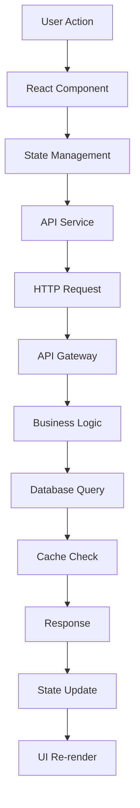
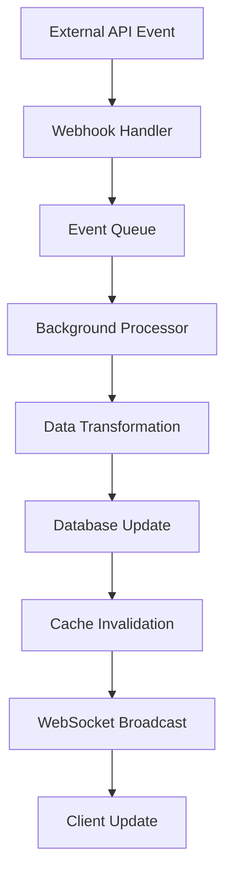
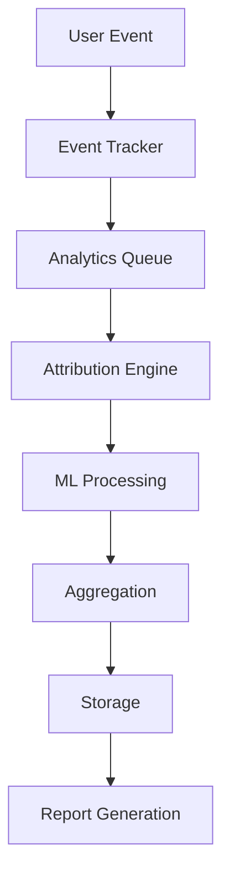

# Ads Pro Platform - Architecture Documentation

## System Overview

The Ads Pro Platform is a comprehensive, enterprise-grade SaaS application designed for multi-touch attribution and advanced campaign optimization. Built with modern technologies and cloud-native principles, it provides real-time analytics, AI-powered optimization, and seamless integration with major advertising platforms.

## Table of Contents

1. [High-Level Architecture](#high-level-architecture)
2. [Component Architecture](#component-architecture)
3. [Technology Stack](#technology-stack)
4. [Data Flow](#data-flow)
5. [Security Architecture](#security-architecture)
6. [Scalability and Performance](#scalability-and-performance)
7. [Integration Architecture](#integration-architecture)
8. [Deployment Architecture](#deployment-architecture)
9. [Monitoring and Observability](#monitoring-and-observability)
10. [Disaster Recovery](#disaster-recovery)

## High-Level Architecture

```
┌─────────────────────────────────────────────────────────────────┐
│                        Ads Pro Platform                         │
├─────────────────────────────────────────────────────────────────┤
│  ┌─────────────────┐  ┌─────────────────┐  ┌─────────────────┐  │
│  │   Web Client    │  │   Mobile App    │  │   API Clients   │  │
│  │   (React SPA)   │  │   (React Native)│  │   (3rd Party)   │  │
│  └─────────────────┘  └─────────────────┘  └─────────────────┘  │
├─────────────────────────────────────────────────────────────────┤
│                        CDN / Load Balancer                      │
├─────────────────────────────────────────────────────────────────┤
│  ┌─────────────────┐  ┌─────────────────┐  ┌─────────────────┐  │
│  │   Frontend      │  │   API Gateway   │  │   WebSocket     │  │
│  │   (NGINX)       │  │   (Express)     │  │   Server        │  │
│  └─────────────────┘  └─────────────────┘  └─────────────────┘  │
├─────────────────────────────────────────────────────────────────┤
│  ┌─────────────────┐  ┌─────────────────┐  ┌─────────────────┐  │
│  │  Auth Service   │  │  Core API       │  │  Analytics      │  │
│  │  (Supabase)     │  │  (Node.js)      │  │  Engine         │  │
│  └─────────────────┘  └─────────────────┘  └─────────────────┘  │
├─────────────────────────────────────────────────────────────────┤
│  ┌─────────────────┐  ┌─────────────────┐  ┌─────────────────┐  │
│  │  AI/ML Engine   │  │  Attribution    │  │  Optimization   │  │
│  │  (TensorFlow)   │  │  Engine         │  │  Engine         │  │
│  └─────────────────┘  └─────────────────┘  └─────────────────┘  │
├─────────────────────────────────────────────────────────────────┤
│  ┌─────────────────┐  ┌─────────────────┐  ┌─────────────────┐  │
│  │   PostgreSQL    │  │     Redis       │  │   File Storage  │  │
│  │   (Primary DB)  │  │   (Cache/Queue) │  │   (S3/GCS)      │  │
│  └─────────────────┘  └─────────────────┘  └─────────────────┘  │
├─────────────────────────────────────────────────────────────────┤
│                     External Integrations                      │
│  ┌─────────────────┐  ┌─────────────────┐  ┌─────────────────┐  │
│  │   Meta Ads API  │  │ Google Ads API  │  │  TikTok/LinkedIn│  │
│  │   (Facebook/IG) │  │   (YouTube)     │  │     APIs        │  │
│  └─────────────────┘  └─────────────────┘  └─────────────────┘  │
└─────────────────────────────────────────────────────────────────┘
```

## Component Architecture

### Frontend Components

#### 1. React Application Layer
```typescript
// Component hierarchy
src/
├── components/           # Reusable UI components
│   ├── ui/              # Base UI components (ShadCN)
│   ├── forms/           # Form components
│   ├── charts/          # Data visualization
│   ├── dashboards/      # Dashboard components
│   └── layout/          # Layout components
├── pages/               # Route components
├── hooks/               # Custom React hooks
├── lib/                 # Utility libraries
├── services/            # API service layer
└── stores/              # State management
```

#### 2. State Management Architecture
```typescript
// Zustand stores structure
interface AppState {
  user: UserState;
  campaigns: CampaignState;
  analytics: AnalyticsState;
  settings: SettingsState;
  ui: UIState;
}

// Real-time updates via WebSocket
const useWebSocket = () => {
  // WebSocket connection management
  // Real-time data synchronization
  // Event handling and state updates
};
```

### Backend Components

#### 1. API Layer
```typescript
// Express.js API structure
src/
├── routes/              # API route handlers
│   ├── auth/           # Authentication routes
│   ├── campaigns/      # Campaign management
│   ├── analytics/      # Analytics endpoints
│   ├── reports/        # Reporting APIs
│   └── integrations/   # External API integrations
├── middleware/         # Express middleware
├── services/           # Business logic services
├── models/             # Data models
├── utils/              # Utility functions
└── config/             # Configuration management
```

#### 2. Service Layer Architecture
```typescript
// Service layer pattern
class CampaignService {
  async createCampaign(data: CampaignData): Promise<Campaign>;
  async optimizeCampaign(id: string): Promise<OptimizationResult>;
  async generateInsights(id: string): Promise<Insights>;
}

class AnalyticsService {
  async trackEvent(event: AnalyticsEvent): Promise<void>;
  async generateReport(params: ReportParams): Promise<Report>;
  async getMetrics(query: MetricsQuery): Promise<Metrics>;
}
```

### Data Layer

#### 1. Database Schema
```sql
-- Core entities
CREATE TABLE users (
  id UUID PRIMARY KEY DEFAULT gen_random_uuid(),
  email VARCHAR(255) UNIQUE NOT NULL,
  role user_role DEFAULT 'CLIENT',
  created_at TIMESTAMP DEFAULT NOW(),
  updated_at TIMESTAMP DEFAULT NOW()
);

CREATE TABLE campaigns (
  id UUID PRIMARY KEY DEFAULT gen_random_uuid(),
  user_id UUID REFERENCES users(id),
  name VARCHAR(255) NOT NULL,
  platform campaign_platform NOT NULL,
  budget DECIMAL(10,2),
  status campaign_status DEFAULT 'DRAFT',
  created_at TIMESTAMP DEFAULT NOW(),
  updated_at TIMESTAMP DEFAULT NOW()
);

CREATE TABLE attribution_data (
  id UUID PRIMARY KEY DEFAULT gen_random_uuid(),
  user_id UUID REFERENCES users(id),
  session_id VARCHAR(255),
  touchpoint_id UUID,
  campaign_id UUID REFERENCES campaigns(id),
  platform VARCHAR(50),
  timestamp TIMESTAMP NOT NULL,
  attribution_weight DECIMAL(5,4),
  conversion_value DECIMAL(10,2)
);
```

#### 2. Caching Strategy
```typescript
// Redis caching patterns
interface CacheStrategy {
  // L1: Application cache (in-memory)
  applicationCache: Map<string, any>;
  
  // L2: Redis cache (distributed)
  redisCache: RedisClient;
  
  // Cache patterns
  patterns: {
    userSessions: '24h TTL',
    campaignData: '1h TTL',
    analyticsResults: '30m TTL',
    reportCache: '6h TTL'
  };
}
```

## Technology Stack

### Frontend Technologies
- **React 19.1.0**: Modern React with concurrent features
- **TypeScript**: Type-safe development
- **Vite**: Fast build tool and development server
- **ShadCN UI**: Modern component library
- **Zustand**: Lightweight state management
- **React Query**: Server state management
- **Chart.js**: Data visualization
- **WebSocket**: Real-time communication

### Backend Technologies
- **Node.js 20+**: JavaScript runtime
- **Express.js**: Web framework
- **TypeScript**: Type-safe backend development
- **Supabase**: Authentication and real-time database
- **PostgreSQL 15**: Primary database
- **Redis 7**: Caching and session storage
- **WebSocket**: Real-time communication
- **Bull Queue**: Job processing

### AI/ML Stack
- **TensorFlow.js**: Machine learning models
- **Python**: ML model training (optional)
- **Scikit-learn**: Statistical analysis
- **NumPy/Pandas**: Data processing

### Infrastructure
- **Kubernetes**: Container orchestration
- **Docker**: Containerization
- **NGINX**: Reverse proxy and load balancing
- **Prometheus**: Metrics collection
- **Grafana**: Monitoring dashboards
- **Jaeger**: Distributed tracing

### Cloud Services
- **AWS/GCP/Azure**: Cloud infrastructure
- **S3/GCS/Blob**: Object storage
- **CloudFront/CDN**: Content delivery
- **Route53/DNS**: Domain management
- **Certificate Manager**: SSL/TLS certificates

## Data Flow

### 1. User Interaction Flow


### 2. Real-time Data Flow


### 3. Analytics Pipeline


## Security Architecture

### 1. Authentication & Authorization
```typescript
// Multi-layer security model
interface SecurityLayers {
  authentication: {
    provider: 'Supabase Auth';
    methods: ['Email/Password', 'OAuth', 'MFA'];
    tokenType: 'JWT';
    sessionManagement: 'Server-side';
  };
  
  authorization: {
    model: 'RBAC (Role-Based Access Control)';
    roles: ['SUPER_ADMIN', 'ADMIN', 'MODERATOR', 'CLIENT', 'VIEWER'];
    permissions: 'Granular resource-based';
  };
  
  dataProtection: {
    encryption: 'AES-256-GCM';
    hashingAlgorithm: 'bcrypt';
    keyManagement: 'AWS KMS / Azure Key Vault';
  };
}
```

### 2. API Security
```typescript
// Security middleware stack
const securityMiddleware = [
  helmet(),                    // Security headers
  rateLimit({                 // Rate limiting
    windowMs: 15 * 60 * 1000,
    max: 100
  }),
  cors({                      // CORS configuration
    origin: process.env.ALLOWED_ORIGINS.split(','),
    credentials: true
  }),
  csrfProtection(),           // CSRF protection
  inputValidation(),          // Input sanitization
  authenticationCheck(),      // JWT validation
  authorizationCheck()        // Role-based access
];
```

### 3. Data Security
```typescript
// Encryption and data protection
class DataProtection {
  // Encrypt sensitive data
  encryptSensitiveFields(data: any): any {
    const sensitiveFields = ['api_keys', 'tokens', 'credentials'];
    return this.encrypt(data, sensitiveFields);
  }
  
  // Audit logging
  auditLog(action: string, user: string, resource: string): void {
    this.logger.audit({
      timestamp: new Date(),
      action,
      user,
      resource,
      ip: this.getClientIP()
    });
  }
}
```

## Scalability and Performance

### 1. Horizontal Scaling
```yaml
# Kubernetes HPA configuration
apiVersion: autoscaling/v2
kind: HorizontalPodAutoscaler
metadata:
  name: ads-pro-platform-hpa
spec:
  scaleTargetRef:
    apiVersion: apps/v1
    kind: Deployment
    name: ads-pro-platform
  minReplicas: 3
  maxReplicas: 100
  metrics:
  - type: Resource
    resource:
      name: cpu
      target:
        type: Utilization
        averageUtilization: 70
  - type: Resource
    resource:
      name: memory
      target:
        type: Utilization
        averageUtilization: 80
```

### 2. Caching Strategy
```typescript
// Multi-layer caching
interface CachingLayers {
  l1: 'Browser Cache (1h-24h)';
  l2: 'CDN Cache (1h-7d)';
  l3: 'Application Cache (5m-1h)';
  l4: 'Redis Cache (15m-6h)';
  l5: 'Database Query Cache (5m-30m)';
}

// Cache invalidation strategy
class CacheManager {
  async invalidateUserData(userId: string): Promise<void> {
    await Promise.all([
      this.redis.del(`user:${userId}:*`),
      this.redis.del(`campaigns:${userId}:*`),
      this.redis.del(`analytics:${userId}:*`)
    ]);
  }
}
```

### 3. Database Optimization
```sql
-- Performance indexes
CREATE INDEX CONCURRENTLY idx_campaigns_user_id_status 
ON campaigns(user_id, status) WHERE status = 'ACTIVE';

CREATE INDEX CONCURRENTLY idx_attribution_data_timestamp 
ON attribution_data(timestamp DESC) WHERE timestamp > NOW() - INTERVAL '30 days';

-- Partitioning for large tables
CREATE TABLE attribution_data_y2024m01 PARTITION OF attribution_data
FOR VALUES FROM ('2024-01-01') TO ('2024-02-01');
```

## Integration Architecture

### 1. External API Integration
```typescript
// API client abstraction
abstract class BaseAPIClient {
  protected baseURL: string;
  protected rateLimiter: RateLimiter;
  protected retryPolicy: RetryPolicy;
  
  abstract authenticate(): Promise<void>;
  abstract makeRequest(config: RequestConfig): Promise<Response>;
}

class MetaAdsClient extends BaseAPIClient {
  async getCampaigns(): Promise<Campaign[]> {
    return this.makeRequest({
      endpoint: '/campaigns',
      method: 'GET',
      rateLimit: { requests: 200, window: '1h' }
    });
  }
}
```

### 2. Webhook Handling
```typescript
// Webhook processing pipeline
class WebhookProcessor {
  async processWebhook(payload: WebhookPayload): Promise<void> {
    // 1. Validate webhook signature
    await this.validateSignature(payload);
    
    // 2. Queue for processing
    await this.queue.add('process-webhook', payload);
    
    // 3. Send acknowledgment
    return { status: 'accepted' };
  }
  
  async handleCampaignUpdate(data: CampaignData): Promise<void> {
    // Update local data
    await this.campaignService.updateFromWebhook(data);
    
    // Trigger real-time updates
    this.websocket.broadcast('campaign-updated', data);
  }
}
```

## Deployment Architecture

### 1. Multi-Environment Setup
```yaml
# Environment configurations
environments:
  development:
    replicas: 1
    resources:
      requests: { cpu: 100m, memory: 128Mi }
      limits: { cpu: 500m, memory: 512Mi }
    
  staging:
    replicas: 2
    resources:
      requests: { cpu: 250m, memory: 256Mi }
      limits: { cpu: 1000m, memory: 1Gi }
    
  production:
    replicas: 3
    resources:
      requests: { cpu: 500m, memory: 512Mi }
      limits: { cpu: 2000m, memory: 2Gi }
```

### 2. CI/CD Pipeline
```yaml
# GitHub Actions workflow
name: Deploy to Production
on:
  push:
    branches: [main]

jobs:
  test:
    runs-on: ubuntu-latest
    steps:
      - name: Run Tests
        run: npm test
      - name: Security Scan
        run: npm audit
  
  build:
    needs: test
    runs-on: ubuntu-latest
    steps:
      - name: Build Docker Image
        run: docker build -t app:${{ github.sha }} .
      - name: Push to Registry
        run: docker push app:${{ github.sha }}
  
  deploy:
    needs: build
    runs-on: ubuntu-latest
    steps:
      - name: Deploy to Kubernetes
        run: kubectl set image deployment/app app=app:${{ github.sha }}
```

## Monitoring and Observability

### 1. Metrics Collection
```typescript
// Prometheus metrics
class MetricsCollector {
  private readonly httpRequestDuration = new Histogram({
    name: 'http_request_duration_seconds',
    help: 'Duration of HTTP requests in seconds',
    labelNames: ['method', 'route', 'status_code']
  });
  
  private readonly activeUsers = new Gauge({
    name: 'active_users_total',
    help: 'Number of active users'
  });
  
  recordRequest(req: Request, res: Response, duration: number): void {
    this.httpRequestDuration
      .labels(req.method, req.route?.path, res.statusCode.toString())
      .observe(duration);
  }
}
```

### 2. Distributed Tracing
```typescript
// OpenTelemetry integration
import { trace } from '@opentelemetry/api';

class CampaignService {
  async createCampaign(data: CampaignData): Promise<Campaign> {
    const span = trace.getActiveSpan();
    span?.setAttributes({
      'campaign.platform': data.platform,
      'campaign.budget': data.budget
    });
    
    try {
      const campaign = await this.repository.create(data);
      span?.setStatus({ code: SpanStatusCode.OK });
      return campaign;
    } catch (error) {
      span?.setStatus({ 
        code: SpanStatusCode.ERROR, 
        message: error.message 
      });
      throw error;
    }
  }
}
```

### 3. Alerting Rules
```yaml
# Prometheus alerting rules
groups:
- name: ads-pro-platform
  rules:
  - alert: HighErrorRate
    expr: rate(http_requests_total{status=~"5.."}[5m]) > 0.1
    for: 5m
    annotations:
      summary: High error rate detected
      
  - alert: HighLatency
    expr: histogram_quantile(0.95, http_request_duration_seconds_bucket) > 2
    for: 10m
    annotations:
      summary: High latency detected
```

## Disaster Recovery

### 1. Backup Strategy
```typescript
// Automated backup system
class BackupManager {
  async createBackup(type: 'full' | 'incremental'): Promise<Backup> {
    const backup = await this.performDatabaseBackup(type);
    await this.uploadToCloud(backup);
    await this.verifyBackup(backup);
    return backup;
  }
  
  async restoreFromBackup(backupId: string): Promise<void> {
    const backup = await this.downloadBackup(backupId);
    await this.verifyBackup(backup);
    await this.performRestore(backup);
  }
}
```

### 2. High Availability
```yaml
# Multi-zone deployment
apiVersion: apps/v1
kind: Deployment
spec:
  replicas: 3
  template:
    spec:
      affinity:
        podAntiAffinity:
          preferredDuringSchedulingIgnoredDuringExecution:
          - weight: 100
            podAffinityTerm:
              labelSelector:
                matchLabels:
                  app: ads-pro-platform
              topologyKey: topology.kubernetes.io/zone
```

### 3. Recovery Procedures
```bash
# Disaster recovery runbook
# 1. Assess damage
kubectl get pods,services,ingress -n production

# 2. Check backup availability
./scripts/backup-automation.sh list

# 3. Restore from backup
./scripts/backup-automation.sh restore latest-backup.dump

# 4. Verify system health
curl https://ads-pro-platform.com/health

# 5. Resume normal operations
kubectl scale deployment ads-pro-platform --replicas=3
```

---

This architecture is designed to support enterprise-grade requirements including high availability, scalability, security, and maintainability. Regular architecture reviews and updates ensure the system evolves with business needs and technology advancements.